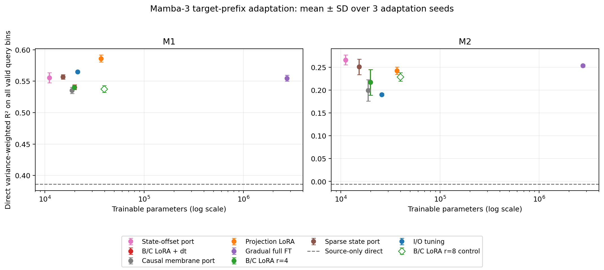

# Mamba-3 cross-session 适配首轮实验（2026-10-03）

状态：主矩阵 50 个运行和容量对照 6 个运行全部完成。用户指定的 gpt-5.6-sol / xhigh reviewer 独立核查全部 56 个正式产物，最终结论为 PASS。

## 协议

本轮检验 target-prefix 适配能否改善现有 Mamba-3 的跨 session 运动解码。M1 与 M2 各使用固定的官方 Mamba-3 SISO source checkpoint：width=256、layers=4、state_size=32、context=128。M1 完整 source decoder 有 2,750,544 个参数，M2 有 2,755,138 个参数。所有方法保持同一 source 权重、输入通道、source normalizer 和 query cohort。

Target session 的前 33 个长度至少 50 bins 的 trial 是 support，其中前 26 个用于梯度训练，后 7 个用于 checkpoint 选择。其余 usable trials 是 query。训练与验证对象中的 query 标签全部置为 NaN；原始 query 标签只在选定 checkpoint 后进入最终评分。固定 1,000 个主训练 step、batch=32、每 50 step 检查全部 prefix-validation 有效 endpoints，step 0 是合法 best 候选。除 source-only 对照外，每方法训练 3 个 seed；source-only 每任务评估一次，共 50 个运行。

主指标是在物理单位上计算的 variance-weighted R²，使用每个 query trial 的全部 eval-valid bins。M1 有 50,591 个 query bins，M2 有 14,115 个。保留 legacy tail 指标用于追溯，但它不决定本轮方法排名。每个 trial 内采用右对齐的因果 128-bin window，左侧零填充，不跨 trial 取上下文。本轮使用本地 held-in cross-session development target，没有读取 held-out。

报告两类输出：直接解码使用适配网络本身的预测；额外 ridge 校准使用同一前 33 个 support trials 的残差拟合。它们分别报告，防止把读出校准收益记为 SSM 微调收益。

## 完整结果

主矩阵 50/50、容量对照 6/6 已完成。下表以 NumPy float64 从正式预测数组重新计算；适配结果为 3 个 seed 的均值 ± 种子间标准差（ddof=0），source-only 为一次固定权重评估。

| 方法 | 训练参数 M1 / M2 | M1 直接 R² | M2 直接 R² | M1 +ridge R² | M2 +ridge R² |
|---|---:|---:|---:|---:|---:|
| Source-only | 0 / 0 | 0.3862 | -0.0059 | 0.4830 | 0.1209 |
| I/O tuning | 21,264 / 25,858 | 0.5649 ± 0.0015 | 0.1902 ± 0.0028 | 0.5665 ± 0.0029 | 0.2074 ± 0.0018 |
| Projection LoRA r=4 | 36,672 / 36,744 | 0.5861 ± 0.0054 | 0.2425 ± 0.0080 | 0.5824 ± 0.0056 | 0.2547 ± 0.0088 |
| B/C LoRA r=4 | 19,776 / 19,848 | 0.5403 ± 0.0037 | 0.2169 ± 0.0281 | 0.5305 ± 0.0015 | 0.2304 ± 0.0255 |
| B/C LoRA + dt | 19,808 / 19,880 | 0.5404 ± 0.0037 | 0.2169 ± 0.0281 | 0.5306 ± 0.0015 | 0.2304 ± 0.0254 |
| Gradual full FT | 2,750,544 / 2,755,138 | 0.5548 ± 0.0048 | 0.2532 ± 0.0028 | 0.5587 ± 0.0039 | 0.2657 ± 0.0021 |
| Sparse state M3 port | 15,168 / 15,240 | 0.5567 ± 0.0036 | 0.2508 ± 0.0171 | 0.5502 ± 0.0026 | 0.2596 ± 0.0138 |
| State-offset M3 port | 11,072 / 11,144 | 0.5553 ± 0.0082 | 0.2660 ± 0.0106 | 0.5429 ± 0.0119 | 0.2645 ± 0.0110 |
| Causal membrane port | 18,752 / 18,824 | 0.5354 ± 0.0049 | 0.1990 ± 0.0234 | 0.5290 ± 0.0048 | 0.2206 ± 0.0184 |
| B/C LoRA r=8 容量对照 | 39,552 / 39,696 | 0.5376 ± 0.0055 | 0.2288 ± 0.0091 | 0.5323 ± 0.0073 | 0.2367 ± 0.0070 |

容量对照保持 source、数据、学习率和 step budget 不变，把 B/C rank 从 4 提到 8，使其训练参数量略高于完整 projection rank-4 LoRA。M1 的 B/C rank-8 直接 R² 为 0.5376，M2 为 0.2288；均未超过相应完整 projection LoRA 的均值。因此，B/C-only 本轮较低的成绩不能仅归因于 adapter 参数量更少。这个对照改变了各投影的 rank，仍不是对某一输入行组独立因果贡献的证明。

本轮更明确的结果是：M1 的完整 projection LoRA 从 source-only 直接 R²=0.3862 提高到 0.5861；M2 的 state-offset 从 −0.0059 提高到 0.2660。额外 ridge 校准并不总提高已适配网络的 query 结果，因此主结论使用直接解码。M2 state-offset 的均值略高于 full FT，训练参数只约为 source decoder 的 0.40%；三 seed 和单 target session 尚不足以证明跨数据集的统计优势。

M2 对评分 cohort 很敏感。历史 legacy cohort 排除每个 query trial 的前 49 个 bins，只剩 2,747 个 bins；all-valid 包含 14,115 个 bins，新增的 trial 起始区段占 80.5%。同一组预测在历史 cohort 上的 state-offset 直接 R² 为 −0.0398，而 gradual full FT 为 0.0604，并且 full FT 在该 cohort 上领先。因此 0.2660 不能直接替代历史口径的成绩，也不能据此说 M2 原有的低 R² 问题已经解决。后续模型判断应同时保留全 trial 和历史尾段两种评分。

保存数组的事后分区诊断进一步核对了全部 50 个主矩阵运行：legacy 的真值与预测都逐元素等于 all-valid 对应位置，200 个指标的 float64 重算误差上界为 2.65e-14。M2 尾段的目标总 SST 为 0.0565253，新增起始区段为 3.3389269；二者的目标分布差异明显。R² 的分母随样本集合的均值和方差变化，不能按 bins 数加权平均区段 R²。完整分区结果见 [评分区段诊断](ssm_peft_cohort_diagnostic_20261003.md)。这项分析只解释已保存的 query 结果，没有用于训练或 checkpoint 选择。

| 方法 | M1 legacy 直接 R² | M2 legacy 直接 R² |
|---|---:|---:|
| Source-only | 0.2968 | -0.1195 |
| I/O tuning | 0.4998 ± 0.0017 | 0.0049 ± 0.0024 |
| Projection LoRA r=4 | 0.5245 ± 0.0064 | -0.0312 ± 0.0111 |
| Gradual full FT | 0.4870 ± 0.0051 | 0.0604 ± 0.0057 |
| State-offset M3 port | 0.4882 ± 0.0100 | -0.0398 ± 0.0079 |

时间尺度调优确实生效：6 个 bc_dt fit 的 4 层、每层 8 个 head 在 best/last 中均有非零 dt_bias 更新，最大 source-relative 差约 0.00292–0.00641，远离 ±1 clamp。B/C+dt 与 B/C-only 的预测并不逐 bit 相同，但本学习率/约束下 R² 增益很小。这个结果不能外推为所有 time-scale tuning 都无效。

当前因果 membrane port 在 M1 为 0.5354、M2 为 0.1990，未表现出优势，并且 M2 seed 波动较大。其 tau 固定为 2，逐 token 更新与作者按 chunk 处理的物理时间尺度不同；本轮只检验这个明确的因果移植版本，不能据此否定作者原方法。

参数成本表统计可训练参数。推理仍需保留约 275 万个 base 参数。主矩阵的全流程 CUDA tensor allocation 峰值约 649–778 MiB，包含 batch-256 评估，不能解释为单独训练的显存峰值。已预热 projection LoRA fit 约 41–43 s，membrane port 约 73–75 s；I/O 和容量对照首个 fit 含编译成本，wall time 不是严格的独占性能基准。这些 GPU 数字不代表芯片面积、能耗或部署延迟。

建议以完整 projection LoRA 作为 M1 强基础线、gradual full FT 作为 M2 历史口径基础线，把低秩 state-offset 保留为全 trial 解码的主要 SSM 研究分支。当前 SSM temporal stack 有 2,729,280 个参数，比 APST Transformer temporal stack 的 2,108,448 个参数约多 29%，因此继续盲目放大 temporal backbone 缺少本轮证据。后续应在固定前端和训练预算下检验多个 target sessions，再检验 source 训练充分性、state_size=64/128 和连续状态 API。本轮没有做与 POSSM 完全相同的输入/训练/评分协议，不能宣称已超过其论文结果。



## 方法和参数范围

| 方法 | 实际调整范围 | 与论文方法的关系 |
|---|---|---|
| none | source 权重不更新 | 同一评估路径的基线 |
| io | 顶层输入/输出投影及 final LayerNorm | POSSM UI 类基础对照 |
| lora | 顶层及每层 SSM 的输入/输出投影 rank-4 LoRA | 通用 projection LoRA |
| bc_lora | 顶层 LoRA、SSM 输出 LoRA、SSM 输入投影的 B/C 行 LoRA | 本项目结构化适配，不叫 SDLoRA |
| bc_dt | bc_lora 加每个 SSM head 的 dt_bias | 有 source-relative 约束的时间尺度适配 |
| full | 先 IO，再最后一层，最后所有层逐步解冻 | POSSM gradual/full FT 类对照 |
| sparse_sdt_m3 | B/C bias 的稀疏 state 维度，加顶层与 SSM 输出 LoRA | M3 专用实验移植，不是原 SDLoRA |
| state_offset | 当前 rotated C 读出上的低秩 state offset，加顶层 LoRA | State-offset 的 M3 坐标移植 |
| memba_causal | SSM gate 中的因果 membrane adapter，加顶层 LoRA | 修改后的因果实验版本，不是作者原实现复现 |

B/C adapter 从 live Mamba-3 属性推导投影行范围。本配置每层 B=[1024,1056)，C=[1056,1088)；dt、A、trap 和 angle 行保持冻结。LoRA 使用紧凑的 selected-row A 参数，没有把不参与函数的 masked rows 计入训练参数量。所有 adapter 参数继承 base 的 device/dtype。

bc_dt 单独使用 0.1 倍基础学习率、零 weight decay，并在每次更新后限制 raw dt_bias 为 source 初值 ±1。固定 prefix 输入探针记录每层 DT/ADT，要求 DT 为正、ADT 为负且全部有限。主训练使用学习率 1e-4、AdamW、全局 gradient clip=1。Full FT 在第 200 step 解冻最后一层，第 400 step 解冻其余层；新增层使用 0.5 倍基础学习率，并保留已有 Adam 状态。每个解冻点先核对上一阶段的冻结参数。

Sparse port 先用 100 个 prefix-train step 训练零初始化的 dense B_bias/C_bias 增量，按学习到的增量平方能量选每层 8/32 个 state 维度，随后精确恢复 source bias。正式适配从零增量开始，只更新这些维度的紧凑参数。保存 warmup loss、delta、scores 和 selections。Warmup 的训练成本单独留档，主结果不能称为原 SDLoRA 的复现。

State-offset 使用 `y_total = kernel_gated_scan + silu(z) * rotated_C * offset`，在 SSM 输出投影前注入。官方 kernel 已门控第一项，新增 offset 单独门控一次。旋转读取坐标包含 normalized C、C_bias、`tanh(angle) * pi`、乘 DT、因果累积、mod 2π 和 BF16 量化。本实现以 PyTorch 复现新增读取项的非线性/三角函数；对官方 kernel 实际 Q_store 的独立 GPU 比较中，99.993896% 的元素逐 bit 相同，最大绝对差 0.00390625、平均绝对差 2.38e-7。

Memba port 修改 kernel 的 Z gate 输入。每个 token 更新独立的低维 membrane，tau=2、threshold=1、越阈值重置为零；下一层只接收下层同一时间点的 membrane。每个独立 window 重置，不对全序列或 batch 做平均。作者 language release 缺少必要的膜状态赋值，vision release 的全序列聚合也不适合本任务的因果解码，因此这里明确报告自定义因果版本。

## 独立实现审核

用户指定的 `gpt-5.6-sol`、`xhigh` reviewer 审查了实现并运行独立 oracles，未修改被审模型代码。初版确实存在影响数值可信度的问题：旧 IO 冻结规则误匹配内部投影、LoRA device/dtype 不继承、masked BC 参数计数虚高、full FT 冻结校验把合法解冻当错误、缺少 step-0 best，以及 state-offset 漏掉角度激活。影响训练和前向的这些问题均在正式训练前修复。汇总器另有数组名和 step-0 分数读取错误；修复后，全部正式产物均重新核查和评分。

修复后，20 项相关 CPU 检查通过，包括真实 optimizer 更新、B/C 梯度与非选行冻结、storage alias、稀疏选择恢复、因果膜状态、query-label perturbation 的训练/选择不变性，以及 checkpoint replay。

GPU 0 的独立 M1 检查覆盖 state-offset 和 causal membrane 两个研究 port，GPU 1 的 M2 检查覆盖全部九方法；两者均使用真实 width-256 source 权重。M2 九方法和 M1 两个研究 port 的零初始化输出与 source 精确相同，研究 adapter 的每层真实梯度非零。M2 九方法在一次真实更新后均通过未来输入不影响前缀的检查；M1 两个研究 port 另通过固定 batch 形状下的样本隔离和独立 window 重置检查。官方 kernel 本身在不同 batch shape 下存在小量数值差，因此所有正式方法使用同一 evaluation batch=256。

正式产物包含 best/last checkpoint、normalizer、训练日志、adapter receipt、逐参数初末 hash、冻结审计、optimizer stages、源码启动 hash、矩阵和 launcher hash、官方 commit、prediction/truth/index NPZ。汇总脚本重新以 NumPy float64 计算 R²，并核对参数计数、best-step argmax、cohort 完全一致和所有 replay metadata。独立 oracle 的主矩阵 50/50、容量对照 6/6 均通过。主矩阵 float64 R² 与记录值的最大绝对差为 1.482469e-7，独立 NumPy ridge 物理预测的最大差为 4.768372e-7。

M1 的 state-offset_seed0 与 memba_causal_seed0 从 best checkpoint 重放共 22 个数组逐 bit 相同，8 个 R² Python float 也相同。重放要求同一 batch=256 和 torch CPU threads=1。全部 56 个运行都通过保存数组、参数张量及来源信息的独立审核；实际完整前向重放覆盖上述两个 M1 研究 checkpoint。最终审核见 [FINAL_REVIEW.md](../results/peft_round1/review/FINAL_REVIEW.md)，机器可读结果见 [FINAL_REVIEW.json](../results/peft_round1/review/FINAL_REVIEW.json)。初版问题与修复过程保留在 PRELIMINARY_REVIEW.md。

## 产物和重现

正式矩阵：`results/peft_round1/official_w256_l4_n32/`。逐 fit 结果与全量汇总：`results/analysis/peft_round1/`。容量对照：`results/peft_round1/bc_rank8_budget_control/`，汇总见 `results/analysis/peft_budget_control/`。冻结实现快照位于两套正式矩阵目录中的 `code_snapshot/`，其字节逐项匹配 fit 启动 hash。

```bash
PYTHONNOUSERSITE=1 /home/xinyuan/miniconda3/envs/spint/bin/python \
  scripts/run_peft_two_gpu.py \
  --matrix configs/peft_round1.json \
  --output-root results/peft_round1/<new-run-name>

PYTHONNOUSERSITE=1 /home/xinyuan/miniconda3/envs/spint/bin/python \
  scripts/summarize_peft.py \
  --root results/peft_round1/<new-run-name> \
  --output results/analysis/peft_round1/<new-run-name>
```

Launcher 为每个 child 强制单 GPU 可见、内部 cuda:0、PYTHONNOUSERSITE=1 和隔离的 Mamba dependencies。运行环境为 torch 2.5.1.post303、CUDA 11.8、Triton 3.5.0。本轮没有 SystemVerilog 或硬件实现。

## 文献与移植边界

[Mamba-3](https://arxiv.org/html/2603.15569v1) 提供本轮官方 SISO core，固定 commit 为 `e9594ce1c732d97440f0332fdc43170a2294dbfa`。[POSSM](https://arxiv.org/html/2506.05320v2) 提供跨 session UI/full FT 基础参照；本文没有把 POSSM-GRU 的 embedding LoRA 结果当作 SSM core LoRA 证据。

[SDLoRA](https://arxiv.org/abs/2410.09016) 的原始稀疏维度选择依赖静态 A_log，Mamba-3 没有该参数。本轮 sparse_sdt_m3 因此是显式改写的 B/C bias energy-selection。[State-offset Tuning](https://arxiv.org/abs/2503.03499) 的原始方法在当前 C 和 gate 下读出状态偏移，本轮保留这一方程并移植到 M3 的旋转状态坐标。[Memba](https://arxiv.org/abs/2506.18184) 的膜状态思路在这里采用逐 token、同时间跨层传递的因果版本，不能把此结果写成作者发布代码的复现成绩。

所有方法在本地 development target 上比较。三 seed 表示同一 source checkpoint 的适配随机性，不能代替多 target-session 或独立 held-out 验证。
